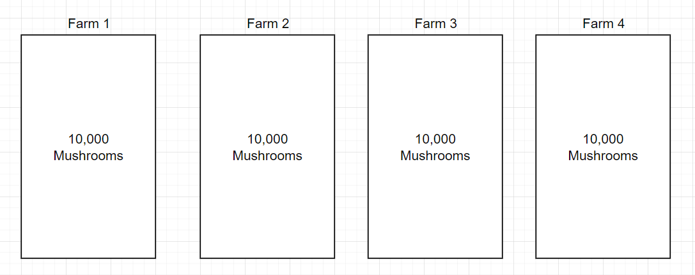

#### Introduction

We all heard about the Central Limit Theorem (CTL) in out basis
statistics class. It is one of the fundamental theorem in statistics and
is applied in numerous analytics and statistics analysis. Without any
delay, let me state what the theorem says:

> Let $X_1, X_2,...., X_n$ be a random sample from a distribution with
> mean $\mu$ and variance $\sigma^2$. Then if $n$ is sufficiently large,
> $\bar{X}$ has approximately a normal distribution with
> $\mu_{\bar{X}} = \mu$ and $\sigma{^2}_{\bar{X}} = \frac{\sigma^2}{n}$.
> The larger the value of $n$, the better the approximation. The larger
> the value of $n$, the better the approximation. Devore, J. L. (2000)

Woof, that's a mathematical definition. Now, let's break it down in
simple words. All that this is saying is that, if we have distribution
(any distribution) and draw $n$ samples for $m$ times and plot it's
histogram then, that will resemble to the normal distribution. As a rule
of thumb, \>30 is a ideal value for the $n$. The below, picture will
give you more sense.


#### The Math Problem

Let's take a math problem that you may have solved in some statistics
class but never realized you utilized the CLT theorem. I am copying this
problem from Devore, J. L. (2000).

> The amount of a particular impurity in a batch of a certain chemical
> product is a random variable with mean value 4.0 g and standard
> deviation 1.5 g. If 50 batches are independently prepared, what is the
> (approximate) probability that the sample average amount of $\bar{X}$
> impurity is between 3.5 and 3.8 g?

The first thing you should note is that, we don't know which
distribution the samples came from. What we know is that, we have 50
batched whose mean is 4 and standard deviation is 1.5. As stated above,
30 is the ideal to use CLT however, here we got 50 so, we should be good
to use CLT. One more thing to note is that, the standard deviation is
for the means not for the sample. So, we have to calculate the standard
error of the mean $(\sigma_{\bar{X}})$ which can be calculated as:
$\frac{\sigma}{\sqrt{n}}$

So, to find the probability we can use the properties of normal
distribution as the samples satisfies the CLT theorem with the
$\mu_{\bar{X}}=4$ and
$(\sigma_{\bar{X}}) = \frac{1.5}{\sqrt{50}} = 0.2121$ so,

$$P(3.5 \leq 3.8) = P \left(\frac{3.5-4.0}{.2121} \leq Z \leq \frac{3.8-4.0}{.2121}\right)$$
$$ = 0.1645$$

I skipped some steps here. We have the get the respective probability
for the Z score and subtract. Since, the main agenda was to understand
the problem and realize how CLT is used to solve, I skipped that part. I
hope, this gives you more sense. At the start of the problem, we didn't
have idea about the distribution but we solved the problem using CLT.
And, that's the power and beauty of CLT.

### The Application

You understood the theorem also solved a math problem and realized it
wasn't that hard. Now let's take a real life application to better
understand the CLT.

#### The Mushroom Farm Problem

Let's suppose you are a farmer and you have a big mushroom farm. To give
more context, let assume you have 4 farming plots where you have planted
about 10,000 mushroom. For simplicity, let's also assume that all the 4
plots nature is somewhat identical. Meaning, the mushroom are planted on
same time, there are same numbers of mushroom planted, they are of same
type and they are also exposed to same fertilizers and environment.

Now you are an agriculturist who have an intense background in
statistics so wanted to know the probability that the mushrooms on your
farms are between some range that will give you maximum profit. If you
harvest it early or late, you wouldn't be able to The simple way to
solve this problem is to measure every mushroom on those 4 field, get
the data and draw a probability distribution to get the answer. The
mushroom farm is visualized below:



However, that solutions have a lot of problems. It is very time
consuming and expensive and definitely not feasible. On other hand, the
statistical problem is that we don't know the distribution of the
mushroom size so we can't do any statistics and probability analysis.

Therefore, in such scenario our CLT comes handy.

#### Solution

So, to find out the probability that our mushrooms are in certain range
we can use the CLT. We are going to draw $n$ samples from the Farm 1.
Since, we assumed our Farms are same. We also going to take $m$ numbers
of samples from the farm. At the end, we will get the $m$ number of
means from the Farm 1 sampling.

We will walk through the Python code to understand it workings.

```{python Library Import}

# Import the Libraries
import pandas as pd
import numpy as np
import seaborn as sns
import matplotlib.pyplot as plt

```

Initially, we said we don't need to know what distribution the samples
comes from and that is still true. However, for the code perspective, I
am going to simulate the data points from the exponential distribution.
In the function `rng.exponential`, the first parameter is
$\beta = \frac{1}{\lambda}$. Therefore, our \$\lambda =1 \$. The mean of
the exponential distribution is $\lambda$ therefore, the mean of the
simulated data points are 1.

```{python Simulated Data}

# Exponential Distribution or Farm 1 data-points
rng = np.random.default_rng(seed=112233)
exp_dist = rng.exponential(1, 10000)

sns.histplot(exp_dist, kde=True)
plt.title("Simulated Exponential Distribution")
```


The below `sample_mean` function calculates the mean of the samples
`sample_size`, up-to `n_samples` times. So, at the end the function will
return the list of the means.

```{python Mean Calculator Function}

# Sample Mean Calculator function
def sample_mean(distribution_array, sample_size, n_samples):

    # Initialized the list to store value
    sample_mean = []

    for i in range(n_samples):

        # Choose the random samples (Sampling)
        sample = np.random.choice(distribution_array, sample_size,)

        # Calculate the mean of the drawn sample
        mean = np.mean(sample)

        # Append the result
        sample_mean.append(mean)

    return sample_mean
```

Now, we will draw the graphs of the sample mean distribution for
different samples that were drawn from the exponential distribution.

```{python}

# Plots for different sample sizes
fig, axs = plt.subplots(2,2)
sns.histplot(ax=axs[0,0], x=sample_mean(exp_dist, 1, 500), kde=True)
axs[0,0].set_title("Sample Drawn: 1, 500 Times")
sns.histplot(ax=axs[0,1], x=sample_mean(exp_dist, 10, 500), kde=True)
axs[0,1].set_title("Sample Drawn: 10, 500 Times")
sns.histplot(ax=axs[1,0], x=sample_mean(exp_dist, 30, 500), kde=True)
axs[1,0].set_title("Sample Drawn: 30, 500 Times")
sns.histplot(ax=axs[1,1], x=sample_mean(exp_dist, 50, 500), kde=True)
axs[1,1].set_title("Sample Drawn: 50, 500 Times")
fig.tight_layout()
plt.show()
```

From the above figure, you can clearly see that as we increased the
sample size, the distribution is getting closer and closer to normal.
With such approximation, we can use the properties of the normal
distribution to calculate the various statistics. For example, if we
collect large samples like more then 30, we can even do t-test among the
different farms even though we don't have any clue what distribution
they follow.

At conclusion, I hope now you have a better understanding of CLT and how
it can be used in practice life. I would highly recommend to watch
[this](https://www.youtube.com/watch?v=N7wW1dlmMaE) video if you want to
understand from a different application perspective.

### References

Devore, J. L. (2000). Probability and statistics for engineering and the
sciences (5th ed.). Duxbury.

365 Data Science. (2020, December 21). Real-world application of the
Central Limit Theorem (CLT) [Video]. YouTube.
<https://www.youtube.com/watch?v=N7wW1dlmMaE>
