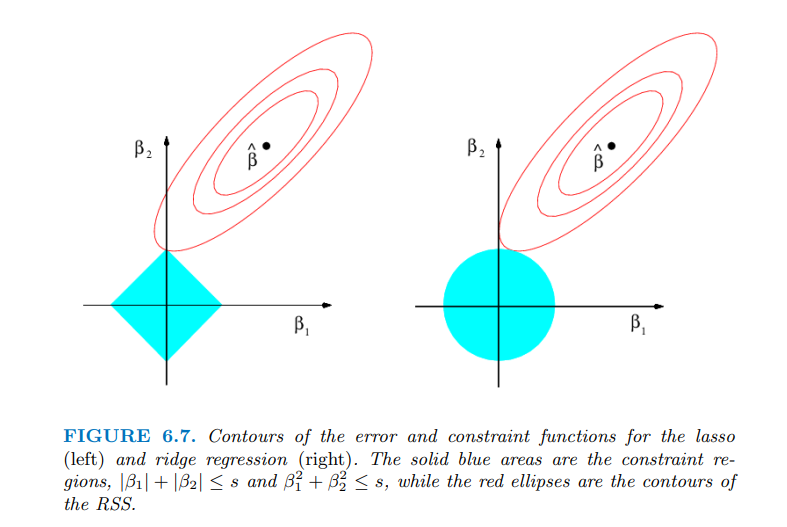

The notion of Regularization arises because of overfitting. So, let's
start with overfitting then. I will keep aside all fancy definition.
Overfitting simply means when your model does good on the training data
but performs poor on the testing data. In other words, the inadequacy of
model to be generalized. The regularization adds the penalty term to
reduce the overfitting.

In Statistical Learning/Machine Learning there are in general 2 kinds of
Regularization. They are as follows:

## 1. Ridge Regression (L2 Regularization)

These regularization techniques follow the same procedure to find the optimal weights
as discussed in [Gradient Descent](https://sharmajee499.netlify.app/post/gradient_multiple_regression/){target="_blank"}.
The only difference is, we add the penalty/regularized term on the cost
function. In particular we add:
$$\lambda \sum_{j=1}^n \theta_{j}^2 \tag{1}$$For instance, if we take
the simple Linear Regression with MSE (Mean Squared Error) as our cost
function then the cost function with regularization will look like:
$$\text{Error}=\frac{1}{n}\sum_{i=1}^n\bigg((y_{i} - \sum_{j =0}^p \theta_{j}x_{ij})\bigg)^2 + \lambda \sum_{j=1}^n \theta_{j}^2$$

In this equation, ${x_{10}, x_{20}, \ldots, x_{n0} = 1}$. The same
formula can be represented in this way too:
$$\frac{1}{n} \sum_{i=1}^n \bigg(y_{i}-\theta_{0}-\sum_{j=1}^p \theta_{j}x_{ij}\bigg)^2 + \lambda \sum_{j=1}^n \theta_{j}^2$$.
These are just different way of saying the same thing just to confuse
novice people and also to make it look fancy. Forget all those fancy
formula just remember:
$$\frac{1}{\text{number of obs.}}\bigg(\text{truth} - \text{predicted}\bigg)^2 + \text{regularization penalty}$$
This is much easier. As we already know, $\theta$'s are the
weight/coefficients. You might noticed or not but our weights starts
with $\theta_{0}$. Weights are the vector that looks like
$[\theta_{0},\theta_{1},\ldots,\theta_{n}]$. If you put close attention
to $Eq1$, you see that we are summing the weights from $\theta_{1}$,
excluding $\theta_{0}$ in the regularization penalty term. I found very straight forward reason in [ISLR
Book](https://www.statlearning.com/){target="_blank"},**"We want
to shrink the estimated associations of the each variable with the
response; however, we do not want to shrink the intercept, which is
simply a measure of the mean value of the response when**
$x_{i1} = x_{i2} = \ldots = x_{ip} = 0$."

Now, the general question is why the regularization works better than
the simple regression methods. The reason lies in the **bias-variance
tradeoff**. Bias-Variance tradeoff could be a whole new topic, but I
will try to explain it in as minimal as possible. You can check out
[this](https://www.youtube.com/watch?v=EuBBz3bI-aA){target="_blank"} for
more info.

Take a instance, where you have a overfitted linear model, meaning the
response and the predicted are close to linear in training data but poor
on the testing data. This means the model has high variance and low
bias. So, in order to decrease the variance, we introduce small bias.
Small increase in bias can decrease the large variance. Therefore, the
ridge regression or regularization performs better when we have high
variance in our model. I know, you lost me in this paragraph but we will
discuss this thing much more in details on our future post.

You may have noticed that in the Ordinary Least Square (OLS) regression,
scaling doesn't have any effect on the $\beta$. (Please note, I am
taking about OLS. Regression using Gradient Descent should be scaled for
efficient convergence). However, for the Ridge Regression the data has
to be scaled to get the correct intrepretable results. So, scale the
data before performing Ridge Regression or any regularization.

## 2. Lasso Regression (Least Absolute Shrinkage and Selector Operator/ L1 Regularization)

One obvious disadvantage of the Ridge regression is that, ridge
regression includes all predictor/features in the final model. This
might not be the problem in term of accuracy however might give hard
time in interpreting the results. With the increasing value of the
$\lambda$, the magnitudes of the coefficient reduces but never reaches
to zero. Therefore, the LASSO regression comes to rescue. In LASSO
regression we add, the following penalized term to the cost function:
$$\lambda \sum_{j=1}^{p}|\theta_{j}|$$Instead of squaring the betas, in
L1 we take the absolute value of the coefficients and sum them. Similar
to the ridge regression, LASSO also shrinks the coefficients/weights
towards zero. However, LASSO also can force some coefficients estimates
equal to be zero when the tuning parameter is sufficiently large.

We have heard and may be utilized the step-wise regression to do the
variable selection. In the similar manner, LASSO can be used to perform
the variable selection. Therefore, the model generated by the LASSO are
easily interpretable as compared to Ridge.

Now, as we already know that majority of the model performance depended
upon the right selection of $\lambda$. We choose a grid of $\lambda$
values and then compute the cross-validation error for each value of
$\lambda$ to get optimal value of $\lambda$.

There is also third variation of the regularization that combine both L1
and L2. It is called Elastic Net. The formula for the elastic net looks
like:
$$\frac{1}{n}\sum_{i=1}^n\bigg((y_{i} - \sum_{1}^p \beta_{j}x_{ij})\bigg)^2 + \lambda_{1} \sum_{j=1}^n \theta_{j}^2 + \lambda_{2} \sum_{j=1}^{p}|\theta_{j}|$$

## Why LASSO can make the coefficients/weights zero but Ridge cannot?

Majority of time, people have explained above question with the below
figure which I extracted from ISLR book.

In simple explanation, the contour is our cost function and diamond (L1)
and circle (L2) are our regularization constrains. From the ISLR
book,"The Ridge regression has a circular constrains with no sharp
points which will not occur on the axis so the estimates will be
exclusively zero. However, for Lasso, because of the corners at each of
the axis, the ellipse often intersect the constrain region at an axis
making the coefficients zero." Please refer to the ISLR book or
[this](https://explained.ai/regularization/constraints.html) article for
in-depth explanation.

I know, it took me a long time to understand this concept too. However,
there is another angle to look at the same explanation. I have made a
small video that will help you to understand the same concept with
different approach.

Please, check out [this](https://youtu.be/W1R33bGYaTA){target="\"_blank"} link or click on the below
picture to watch video. 

### References

James, G., Witten, D., Hastie, T., & Tibshirani, R. (2013). *An
introduction to statistical learning* (1st ed.) [PDF]. Springer.
