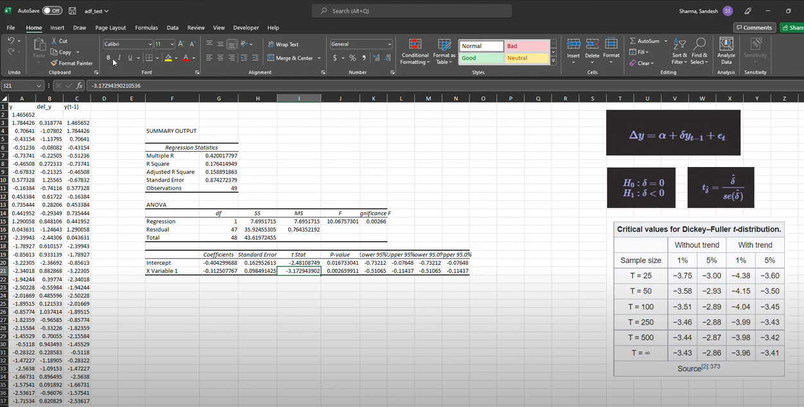

Stationarity is one of the major concept that needed to be understood in
order to model any time series. The
[Wikipedia](https://en.wikipedia.org/wiki/Stationary_process){target="_blank"}
defines stationary process as *"a stochastic process whose unconditional
joint probability distribution does not change when shifted in time."*.
This simply means the given time series will have constant mean,
variance and auto-correlation which are independent of time. Various
forecasting models assumes the data to be stationary. Below I am quoting
the words from the [*Time Series Forecasting In
Python*](https://www.manning.com/books/time-series-forecasting-in-python-book){target="_blank"}
which clearly says why stationarity matters for forecasting.

> "These models can only be used if we verify that the data is indeed
> stationary. Otherwise, the models will not be valid, and the forecasts
> will not be reliable. Intuitively, this makes sense, because if the
> data is non-stationary, its properties are going change over time, and
> so it would mean that our model parameters must also change through
> time. This means that we cannot possibly derive a function of future
> values as a function of past values, since the coefficients change at
> each point in time, hence making forecasting unreliable."

Therefore, before modeling any forecast model we need to check the
stationarity of the time series data.

### Augmented Dickey-Fuller Test (ADF Test)

ADF is an one of the common method to test the stationarity of the data.
ADF is similar to the Dickey-Fuller Test. The only difference between
the ADF and Dickey-Fuller Test is that Dickey-Fuller Test is used for
AR(1) (Autoregressive model with order 1) model whereas ADF is augmented
version used to generalize AR(p) models. You can refer to
[this](https://www.thoughtco.com/the-augmented-dickey-fuller-test-1145985){target="_blank"}
website for more details.

In this article, we will derive the Dickey-Fuller test and expand the
same concept to understand ADF.

We have a univariate time-series data of $y$ then, the Autoregressive
model of order 1 (AR 1) can be written in :
$$\text{AR (1) → } y_{t} = \alpha + \phi_{1}y_{t-1} + \epsilon_{t}  \tag{1}$$
Here, $\alpha$ is a constant, $\epsilon_{t}$ is a white noise and
$\phi_1$ is a coefficient. You might find this equation resembling to
the simple linear regression equation. For now, you can think like that.

Now, our hypothesis are: $$H_0 : \phi_1=1$$$$H_1 : \phi_1 < 1$$ If
$\phi_1$ equals to one then, we have a unit root. That means we have a
random walk, which is not stationary. However, if $\phi_1$ \< 1 means
the process is stationary. In a random walk, the present $y_t$ is a
function of previous time stamp $y_{t-1}$, a constant $\alpha$, and
random number $\epsilon_t$ also known as white noise.

Now, we will change the $Equation1$ to find out our test statistics.

First, we will subtract $y_{t-1}$ from both sides

$$y_t - y_{t-1} = \alpha+ \phi_1 y_{t-1} + \epsilon_t - y_{t-1} $$ Let's
assume, $y-y_{t-1} = \Delta y$

$$\Delta y = \alpha + (\phi_1 -1)y_{t-1}+ \epsilon_t$$ We will change
this equation slightly

$$\Delta y = \alpha + \delta y_{t-1}+ \epsilon_t$$ where,
$\delta = \phi_1 -1$

Now, our hypothesis changes to

$$H_0: \delta = 0$$$$ H_1: \delta < 0$$

The t-statistics is calculated via the same formula that we use in
linear regression which is:

$$t_{\hat{\delta}} = \frac{\hat{\delta}}{se(\hat{\delta})} \tag{2}$$ We
will compare the t-statistics that we get from $Equation2$ and compare
it with the critical value. The only different thing is we will compare
the critical value with the Dickey-Fuller Distribution Table which can
be seen on the below figure.

[](https://en.wikipedia.org/wiki/Augmented_Dickey%E2%80%93Fuller_test)

If the calculated t-statistics is less then the critical value, we
reject the null hypothesis stating that the time-series is stationary.

The Augmented Dickey-Fuller Test follows the same method instead the
equation becomes:

$$y_t=\alpha+\sum_{i=1}^{p}\phi_iy_{t-i}+\epsilon_t \tag{3}$$
$Equation3$ is the AR(p) model. If we follow the same procedure like
above for the Dickey-Fuller test we get:

$$\Delta y_t = \alpha+\delta y_{t-1}+\sum_{i=1}^{p}\beta_{i}\Delta y_{t-i} +\epsilon_{t}$$
Our Null and Alternative hypothesis remains the same and we calculate
the test statistics for the $\delta$

### Excel Demo

I know, the title sounds very old. But, the whole purpose of doing this
in excel is to understand the basic core concept of the Dickey-Fuller
Test. I will be performing the Dickey-Fuller test on AR(1) model. The
data is randomly generated using the `statsmodel` package in `Python`.

The demo video can be found at: <https://youtu.be/R-WVz9YiaN8>

Or simply, click on the picture below.

[](https://youtu.be/R-WVz9YiaN8)

### Python Demo

We will also use the same data (data used in Excel) for the ADF test in
Python.

```{python Importing the Libraries}
import pandas as pd
import numpy as np

from statsmodels.tsa.arima_process import ArmaProcess #for data generation
from statsmodels.tsa.stattools import adfuller #adf test
```

```{python Data Generation}
# Assigning random coefficient 
ar1 = np.array([1, -0.9])

# Since we are generating AR1 data the MA part remains constant
ma1 = np.array([1])

ar_obj = ArmaProcess(ar1, ma1)

np.random.seed(112233)

# Simulate the Data
simulate_ar1 = ar_obj.generate_sample(nsample=50)

# Convert the data to pandas data-frame
sim_ar1 = pd.DataFrame({'data': simulate_ar1})
```

```{python ADF Test}

adf_test_ar1 = adfuller(sim_ar1['data'])

print(f"The t-stat is: {adf_test_ar1[0]}")
print(f"The p-value is: {adf_test_ar1[1]}")

```

From the above result, we saw that the p-value is less than 0.05 which
means we reject the null hypothesis stating that the series is
stationary.

In conclusion, ADF test is the first step taken in any time-series
modeling. ADF test being a statistical test makes sure that the data
that we working on follows the basic assumption of stationarity or not.
In this article, we saw the basic math behind the DF and expanded it to
understand ADF. We also implemented the demo in Excel as well as further
validated the same results in Python.
