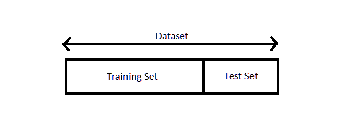
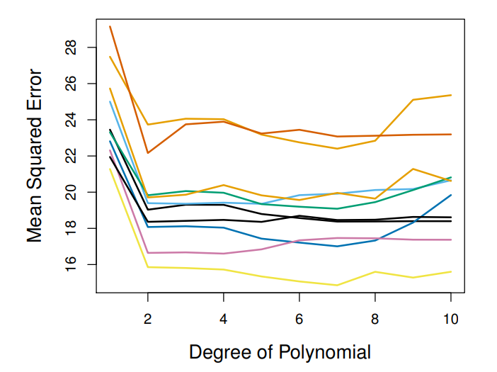
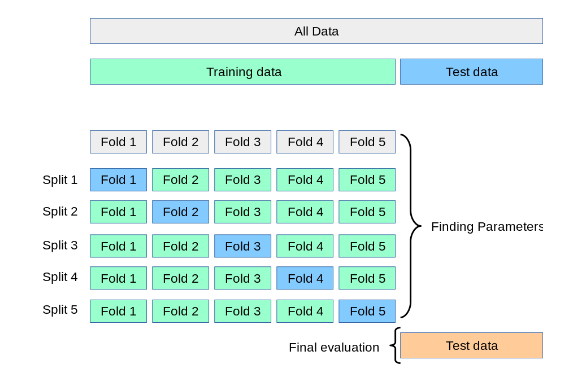
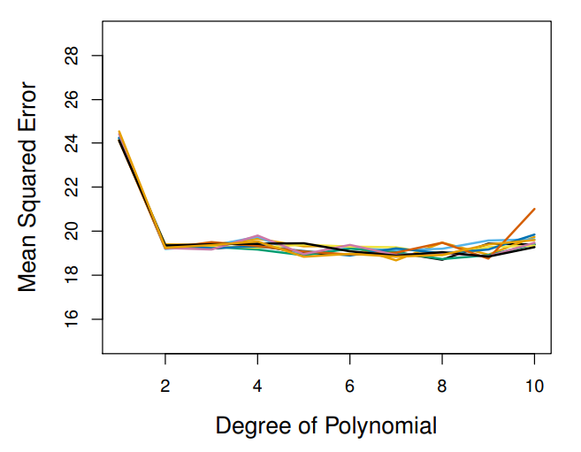
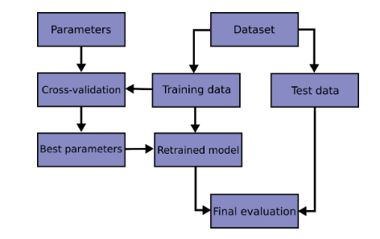

## 1. Train-Test Split

### Splitting the data into training and testing set

[](https://tinyurl.com/2p8xdskx)

#### Pros:

1.  It's the most basic and efficient way of model evaluation.
2.  Computationally In-expensive

#### When to use?

1.  If you have very large test-set.
2.  Less computational resources.

#### Cons

1.  Test error can be highly variable depending on which observation are included in the training and testing set.

[](https://www.statlearning.com/)

1st degree: $y_{1} = \beta_{0}+x_{1}\beta_{1}$

2nd degree: $y_{2} = \beta_{0}+x_{1}\beta_{1}+x_{1}^{2}\beta_{2}$

2.  The model is trained on few data which might decrease the performance of trained model.

### K-Fold Cross Validation

[](https://scikit-learn.org/stable/modules/cross_validation.html)

1.  Randomly divides the instances into k groups of equal size.
2.  Sets 1 group for testing and other for training.
3.  Repeated k times.
4.  Average the test error for final error value.

#### Pros:

1.  Less variability in the test error when ran multiple times.

[](https://www.statlearning.com/)

2.  Robust and Reliable result as we trained out model on every data points.

#### Cons:

1.  Computationally Expensive

### FAQs

1.  What is the best way to split dataset for Cross-Validation?

-   Train-Test split
-   Cross-Validate on Train Dataset
-   Find best parameters
-   Retrain the model on whole training dataset
-   Final evaluation is done on Test set

[](https://www.statlearning.com/)

2.  What is the right value of the K?

-   It depends upon your scenario however, it is recommended 5 or 10 are best choices.
-   Empirically it is shown that 10 fold is ideal. Refer: *Kohavi, R. (1995). A Study of Cross-Validation and Bootstrap for Accuracy Estimation and Model Selection. International Joint Conference of Artificial Intelligence. <http://robotics.stanford.edu/~ronnyk>*

### Demo

#### Train-Test Split

```{python Get the Data}

from sklearn.datasets import make_classification
from collections import Counter

# Make the Synthetic Data
X, y = make_classification(n_samples=1000, n_features=2, n_redundant=0, weights=[0.80],flip_y=0.3, random_state = 112233)

# Data Statistics
print(f"Total number of instances in the dataset are {len(X)}")
print(f"The target class is imbalanced: {Counter(y)}")
```

```{python Train-Test Split}

from sklearn.model_selection import train_test_split

# Train-Test Split
X_train, X_test, y_train, y_test = train_test_split(X, y, random_state = 112233, test_size=0.3, shuffle=True, stratify=y)

print(f"There are {len(X_train)} instances on the training and {len(X_test)} on testing set")
```

```{python Fit the Model}

# Train a Logistic regression model 
from sklearn.linear_model import LogisticRegression
from sklearn.metrics import f1_score


# Fit the model
lg = LogisticRegression().fit(X_train, y_train)

# Score on the training data
print(f"Training Data Accuracy: {lg.score(X_train, y_train)}")
print(f"Training Data F1: {f1_score(y_train, lg.predict(X_train))}")
print("\n")


# Predict the model
lg_pred = lg.predict(X_test)


# Evaluation on the testing set
print(f"Testing Data Accuracy: {lg.score(X_test, y_test)}")
print(f"Testing Data F1: {f1_score(y_test, lg_pred)}")
```

#### Cross Validation

```{python Cross Validation}

from sklearn.model_selection import StratifiedKFold


kf = StratifiedKFold(n_splits = 10, shuffle=True, random_state=112233)

#  Accuracy
scores_CV_acc = []
scores_test_acc = []

# F1 Score
scores_CV_f1 = []
scores_test_f1 = []

```


```{python CV Score}

for train_index, test_index in kf.split(X_train, y_train):
  
  X_trainCV, X_testCV = X_train[train_index], X[test_index]
  y_trainCV, y_testCV = y_train[train_index], y[test_index]
    
  lg_cv = LogisticRegression(random_state=112233).fit(X_trainCV, y_trainCV)

  scores_CV_acc.append(lg_cv.score(X_testCV, y_testCV))
  scores_test_acc.append(lg_cv.score(X_test, y_test))

  scores_CV_f1.append(round(f1_score(y_testCV, lg_cv.predict(X_testCV)),2))
  scores_test_f1.append(round(f1_score(y_test, lg_cv.predict(X_test)),2))
    
  print(lg_cv.score(X_testCV, y_testCV))
  
```


```{python}
for i in scores_test_f1:
  print(i)
  
```

