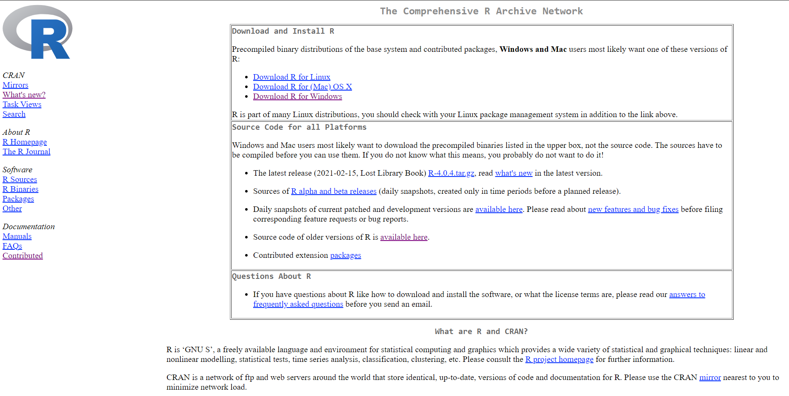
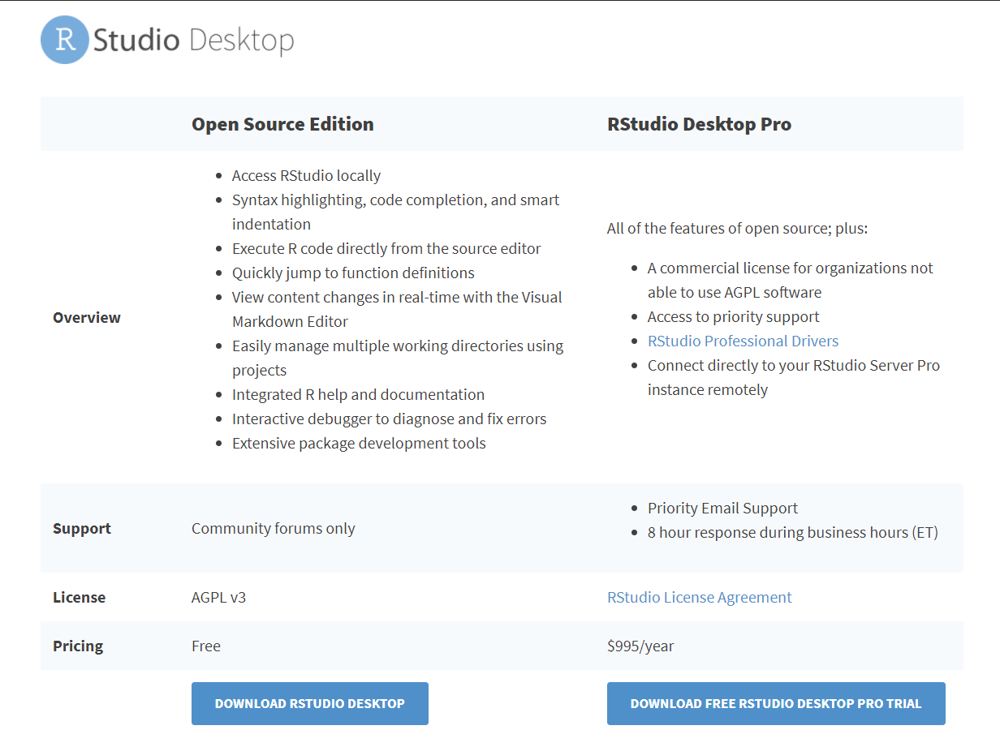

**R** is a beautiful and powerful programming language. People always
debate about the Python vs. R. For me, both have advantages in their
respective fields. I have used Python and R for about equal amount of
time. Personally, I find R to be more powerful in data manipulation,
cleaning, summarizing and making statistical models. However, Python is
more easy to work when it comes to deep learning and advance
computational modeling. Moreover, Python is general purposed programming
language meaning, it could be used to make anything. I mean anything
like website, computer software, mobile app, API etc.

### How to Install R ?

One basically needs to download two things to get started with R coding
i.e. R & R Studio. Think R as a engine whereas R studio as the whole car
which supports the engines execution.

1.  Download R from CRAN (Comprehensive R Archive Network)

First of all go to [this](https://cran.r-project.org/) website and
download the needed file depending upon your operating system. After you
downloaded, install the file and you are all set for first part.

1.  Download R Studio

Now after downloading the R, you are all set to download the R Studio
from [this](https://rstudio.com/products/rstudio/). Install the R Studio
by opening up the downloaded file. There is nothing wierd setting to be
set while installing, go with the flow.

If everything goes alright you should be able to set the R environment
for you analytical journey.

