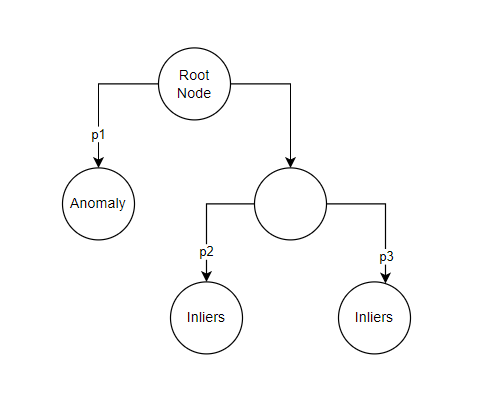
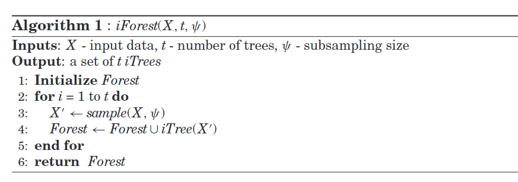
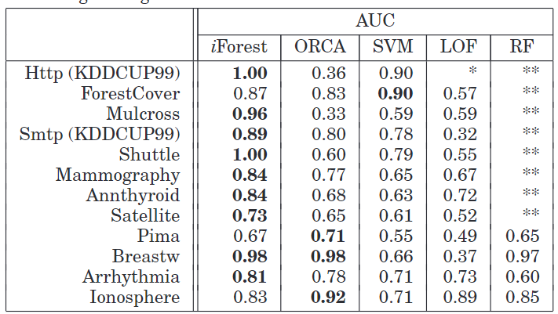
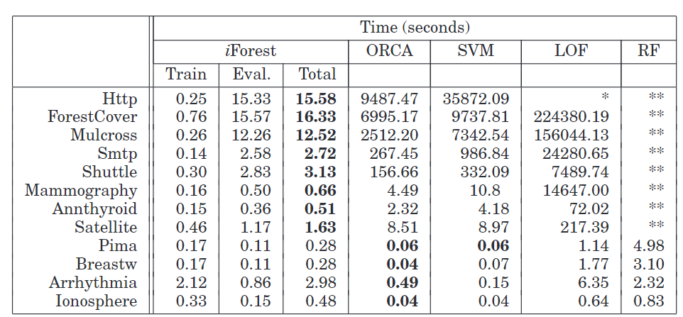

### Introduction

According to the
[Wikipedia](https://en.wikipedia.org/wiki/Anomaly_detection), "Anomaly
detection (also referred to as outliers detection and sometimes as
novelty detection) is generally understood to be the identification of
rare items, events or observations which deviate significantly from the
majority of the data and do not conform to a well defined notion of
normal behavior." So, basically we are identifying any weird events or
data points. Now, these anomalies could be good or bad depending upon
your problem. For instance, in fraud detection the anomalies are bad,
meaning you want to reduce as much as possible. However, if you are
trying to find a new star in the galaxy then the anomalies in the
astronomy image might be good for you.

The application of the anomaly can be found in many domains like
cyber-security, financial fraud, medicine, law-enforcement, network
traffic, fault detection etc. The common nature of the problem in all of
those domains are there will be very few instances of the anomalies and
most of the data are normal. It's like finding a needle in the haystack.

The simple outliers analysis that is done using box-plot's IQR range,
Z-test are lighter version of the outliers analysis. However, it is not
robust where the data goes beyond uni-variate. Therefore, there are
various machine learning algorithms are developed that are more robust
and efficient in finding the outliers/anomalies.

Anomaly detection can be supervised or un-supervised depending upon the
dataset and data labels. In general, unsupervised technique is more
common and relevant to the application. Below, we will talk about an
unsupervised machine learning algorithm known as Isolation Forest to
detect anomalies.

### Isolation Forest

From the name, you might have guessed it should be somewhat similar to
the ['Random Forest'](https://en.wikipedia.org/wiki/Random_forest),
which is true. Isolation Forest is the ensemble method which fits
numerous decision tree and aggregate the results from the each tree to
get the outcome. Even though the basic principle of Random Forest and
Isolation Forest are same, there are some subtle differences which I
will be discussing below. You should definitely have some basic
foundation knowledge of Random Forest to understand the comparison.

1.  Data Subset:

    In the random forest, the data is bootstrapped meaning the
    sub-samples are selected with replacement. However, in the Isolation
    Forest random data points are selected without replacement which
    means the there will not be any duplication in the sub-sampled data
    set. According to the original paper, the idle number of sample for
    the each tress in the Isolation Forest is 256 (Liu et.al 2012)

2.  Split Criteria

    In the decision tree that is build under Random Forest, Gini
    Impurity, Entropy or Information Gain criteria are used to find the
    best features for splitting the nodes. However, in isolation forest
    the nodes are split randomly. According to Liu et.al (2012),
    "Partitions are generated by randomly selecting an attribute and
    then randomly selecting a split value between the maximum and
    minimum values of the selected attribute."

Now, let's try to understand what does it means by isolation and how
does it work.

#### The Idea of Isolation

According to the original paper by Liu et.al (2012), isolation means
"separating an instance from the rest of the instances". The main
intuition behind isolation is that, the anomalies will be isolated early
as compared to inliers. The collective distance(from root node to leaf
node of respective anomalies) of the random decision tree for anomalies
will be shorter. Let's look at the below figure to understand it more.



From the diagram, let suppose it is one of the decision tree from our
isolation forest. Let P1 be the path distance for the anomaly and p2,p3
are for the inliers. The main intuition is that anomalies will be
isolated early or split early because they are far away from the normal
cluster. Therefore, the path distance will be shorted. Now, we average
the path distance from all of the trees for the respective data-points.

#### Algorithm Breakdown

The anomaly detection using iforest can be broke down into two steps
i.e. training and evaluation. I will not got over nitty-gritty details
on the math but will try my best to make you understand the working
principles.

##### Training

In this phase, we are building the decision tress from our data. Below
is the training algorithm that I extracted from original paper.



The inputs are the $X$ (data), $t$ (number of trees in forest), $\psi$
(sub-sampling size). The $\psi$ is the number of random observation
taken from the original data $X$ while making the forest. Empirically,
it is found that 256 is the ideal number for a various anomaly detection
problems. In the loop part of algorithms, we are basically making the
decision tree with the sub-sampling size to make an forest.

##### Evaluation

In the evaluation stage, the path distance is calculated from the each
tree and aggregated. After, calculating the distance, at the end,
anomaly scores are calculated for the each observations. I am not going
to explains the details of the formula here but just stating for
reference only:

$$s(x,\psi) = 2^\frac{-E(h(x))}{c(\psi)}$$

Here, $E(h(x))$ is the average path of the decision tree/isolation
trees, $c(\psi)$ is the average path length of unsuccessful searches in
Binary Search Tree. $c(\psi)$ is use to normalize the scores.

The anomaly score, $s$ can be used to make the following assessment:

-   If instances return $s$ very close to 1, then they are definitely
    anomalies,
-   If instances have $s$ much smaller than 0.5, then they are quite
    safe to be regarded as normal instances, and
-   If all the instances return $s≈0.5$, then the entire sample does not
    really have any distinct anomaly.

#### Performance as Compared to Other Anomaly Detection Algorithm

There are various anomaly detection algorithms out there. Some of the
famous ones are one-class SVM, clustering based methods (K-Means),
density-based (KNN). Here, I am not comparing myself but re-iterating
the result achieved by the authors in the original paper. They compared
various open-sourced dataset with the algorithms such as ORCA (Bay
et.al. 2003), LOF (Breunig et,al. 2000), one-class SVM and Random
Forest.

Even though anomaly detection mostly is unsupervised learning (unlabeled
data) but for the purpose of comparison authors have used the labeled
data and calculated AUC score. From the below figure, you can see
iforest is achieving highest AUC score on most of the datasets. The $**$
means out of memory.(The author used low powered computing processor for
comparison)



The performance of the algorithm might depend on one's respective
problem and use case. However, IForest is not only popular for it's
performance but also for the training and evaluation time. The Isolation
Forest is pretty fast as compared to other algorithms. The below figure
compares the time taken by different compared algorithm. The $*$ means
execution will take more then 2 weeks because of the larger dataset. The
top most dataset are larger dataset. The authors have concluded that the
algorithms performs efficient and fast even when the dataset are
extremely large. For reference, $Http$ dataset have 567,497 instances.



#### Python Code Demo with Sklearn

In this section, I will demo how to implement the Isolation Forest in
Python using the Scikit-Learn (sklearn) Library. I am using a dummy
dataset that is also synthetically generated using sklearn.

```{python Library Import}

# Libraries Import

from sklearn.datasets import make_blobs, make_moons
import pandas as pd
import numpy as np
from sklearn.model_selection import train_test_split
from sklearn.ensemble import IsolationForest
from sklearn.metrics import accuracy_score
from sklearn import tree
from matplotlib import pyplot as plt
import warnings
warnings.filterwarnings('ignore')

```

```{python Dummy Data}

# Dummy dataset Generation
data = make_blobs(centers=[[0,0],[2,2]], 
                  cluster_std=0.4, 
                  n_samples=[350,10], 
                  n_features=2, 
                  random_state=112233)

# Features of the 'data'
feat = pd.DataFrame(data[0], columns=['X1', 'X2'])

# Target column of the 'data'
target = pd.DataFrame(data[1], columns=['target'])

# Combine Both to make a data-frame
df = pd.concat([feat, target], axis=1)

print(df['target'].value_counts())

"""There are total 360 data-points, out of which 350 are of class 0 and 10 of class 1. Also, there are 2 continuous features names as X1 and X2. As mentioned previously, even anomaly detection is majorly unsupervised, for the sake of comparision we are derriving as supervised learning"""

```

```{python Data Split}

# Train-Test Split
X_train, X_test, y_train, y_test = train_test_split(feat, target, train_size=0.7, 
                                                    random_state=112233, 
                                                    stratify=target, 
                                                    shuffle=True)

```

```{python Data Viz}

# Visulize the Train & Test data
fig, axs = plt.subplots(1,2)
axs[0].scatter(x=X_train['X1'], y=X_train['X2'], c=y_train['target'],)
axs[0].set_title("Train Data")
axs[1].scatter(x=X_test['X1'], y=X_test['X2'], c=y_test['target'])
axs[1].set_title("Test Data")
plt.show()

"""From the figure, it is clear that what data-points are anomaly. However, this
is just for test case. Yellow points (class 1) are out anomalies."""
```

```{python Model Fitting}

# Fit Isolation Forest Model
"""By default, the model will have 100 tress and the subsample size is 256. 
There is another parameter call contamination rate, which is percentages of 
anomalies supposed to present in the dataset."""

mdl = IsolationForest(random_state=112233, contamination=0.02).fit(X_train)

```

```{python}
# Visualizing one of the Isolation Tree
#fig, ax = plt.subplots(1,1)
_ = tree.plot_tree(mdl.estimators_[0])
plt.show()
```

The visual of the above figure is not that clear and that's not what I
want you to notice. In theory, we mentioned that the anomalies will be
separated as leaf node with few split as compared to the in-liers. So,
if you look at the decision tree right hand part, there are bunch of
values that are separated with just few split however, majority of them,
on left side, took many splits. Those data-points that took few split
are anomalies. This is just for a single tree and remember we have 100.

```{python Evaluation}

# Prediction on the Test Data
pred = mdl.predict(X_test)

"""The Predict function outputs the values as 1 and -1. -1 being anomalies. 
We need to convert this back to 0 and 1. For us the class 1 are anomalies"""

# Decode to it original format
pred_decode = [1 if i==-1 else 0 for i in pred]

# Accuracy
print(f"The accuracy is: {accuracy_score(y_test, pred_decode)}")

"""We got the accuracy of 100% on the test data, which is what I was expecting, as the data was easily sepearatable. 
However, the purpose of the demo is to understand how to use algorithm with sklearn. You will face complex situation in real-world"""
```

#### Additional Notes

##### Contamination Rate

Contamination rate is the ratio of anomalies presented in the dataset.
We can get the value for contamination rate from our domain knowledge
depending upon the problem or by looking at the historic trend. The
contamination rate/level ranges between 0.02 and 0.5. If the
contamination rate is way higher like 0.5 and above, I think the problem
will change from anomalies detection to something like classification or
clustering. The accuracy and predictive performance depends upon the
contamination level so, it is crucial to identify relevant contamination
level before modeling.

##### Continuous Variable

In the original paper too, only continuous variables are used. We
definitely can do one-hot, ordinal and other types of encoding to
convert the categorical data to it's respective numeric values. I am not
sure, how the algorithm performs when we have majority of categorical
features. That will be something to experiment with in future.

Finally, we are at the end, I hope this article gives your basic
intuition about the isolation forest and it's working principles along
with some hands-on demo in Python. One will see problems of anomaly
detection widely in the real-world therefore, it is important to have
some tools and knowledge to tackle those problems. I would highly
recommend to read the original paper by Liu. et.al (2012), which
contains a through information on algorithms and also on comparison with
other anomaly detection methods.

### References

Anomaly detection. (2023, January 2). In Wikipedia.
<https://en.wikipedia.org/wiki/Anomaly_detection>

::: csl-entry
Bay, S. D., & Schwabacher, M. (2003). Mining Distance-Based Outliers in
Near Linear Time with Randomization and a Simple Pruning Rule.
<i>Proceedings of the Ninth ACM SIGKDD International Conference on
Knowledge Discovery and Data Mining</i>, 29--38.
:::

::: csl-entry
Breunig, M. M., Kriegel, H.-P., Ng, R. T., & Sander, J. (2000). LOF:
Identifying Density-Based Local Outliers. <i> Proceedings of the 2000
ACM SIGMOD International Conference on Management of Data</i>, 93--104.
:::

::: csl-entry
Liu, F. T., Ting, K. M., & Zhou, Z.-H. (2012). Isolation-based anomaly
detection. <i>ACM Trans. Knowl. Discov. Data</i>, <i>6</i>(3), 39.
<https://doi.org/10.1145/2133360.2133363>
:::
